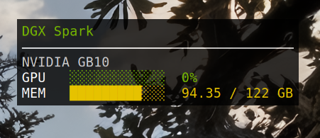

# dgx-widget

A lightweight desktop widget that displays live GPU utilization and system memory stats from a remote [NVIDIA DGX Spark](https://www.nvidia.com/en-us/products/workstations/dgx-spark/) over SSH.

Built on [Conky](https://github.com/brndnmtthws/conky), it renders as a transparent overlay pinned to the desktop — always visible, never in the way.



## How it works

A shell script (`dgx_metrics.sh`) opens a persistent SSH `ControlMaster` connection to the DGX and polls it every 3 seconds, querying `nvidia-smi` for GPU utilization and `/proc/meminfo` for system RAM. Results are formatted as Conky markup with color-coded progress bars and fed to the widget via `execpi`. The ControlMaster socket is reused across polls so there is no per-refresh SSH handshake overhead.

Color thresholds:

| Usage | Color |
|---|---|
| < 60% | Green |
| 60–79% | Yellow |
| 80–94% | Orange |
| ≥ 95% | Red |

## Requirements

- **Local machine:** Conky, SSH client
- **DGX:** SSH access, `nvidia-smi` available

Install Conky on Ubuntu/Debian:

```bash
sudo apt install conky-all
```

## Setup

```bash
git clone https://github.com/YOUR_USERNAME/dgx-widget.git
cd dgx-widget
./setup.sh
```

`setup.sh` will:
1. Stamp the repo path into `dgx.conkyrc` and `dgx-widget.desktop`
2. Copy `.env.example` to `.env`

Then edit `.env` with your DGX's address and credentials:

```bash
DGX_HOST=192.168.1.100   # IP or hostname of your DGX Spark
DGX_USER=admin           # SSH username
DGX_SSH_KEY=$HOME/.ssh/id_ed25519  # path to your SSH key (optional, this is the default)
```

## Running

Start the widget manually:

```bash
conky -c dgx.conkyrc
```

Or add it to autostart so it launches with your desktop session:

```bash
cp dgx-widget.desktop ~/.config/autostart/
```

The `.desktop` entry waits 10 seconds after login before starting Conky, giving the desktop environment time to fully initialize.

## Files

| File | Purpose |
|---|---|
| `dgx_metrics.sh` | Fetches metrics from the DGX over SSH and emits Conky markup |
| `dgx.conkyrc` | Conky configuration — layout, font, transparency, poll interval |
| `dgx-widget.desktop` | XDG autostart entry |
| `setup.sh` | One-time setup script |
| `.env.example` | Configuration template — copy to `.env` and edit |
